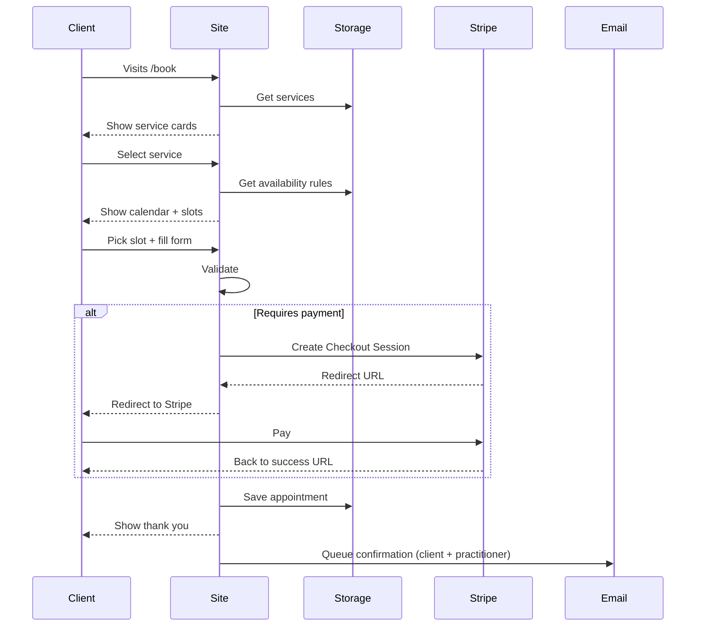
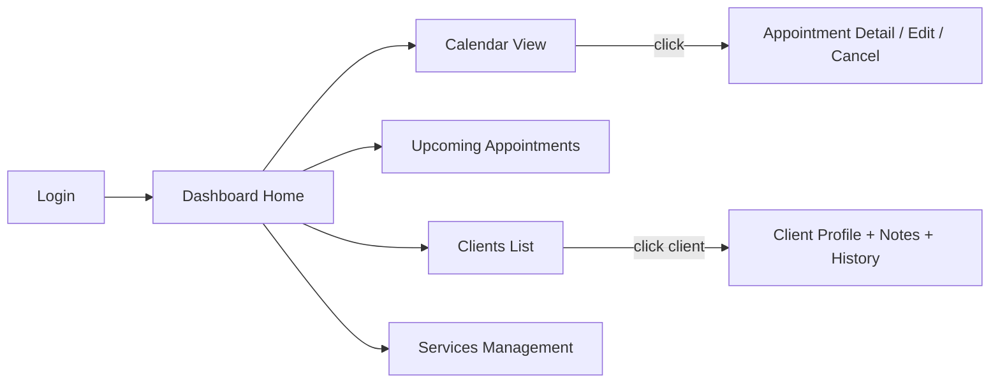

Here is a structured output containing the requested documentation files.  
I tried to keep explanations clear, junior-friendly, concise where possible, and focused on calm / trust-building UX suitable for holistic therapy practitioners.

```markdown
# 1. PRD.md
```

```markdown
# Valeries-Psychological-Wellness – Product Requirements Document (MVP)

## Executive Summary

Valeries-Psychological-Wellness is a modern, calming online booking and lightweight practice management platform built specifically for holistic therapists, massage therapists, energy healers, somatic coaches, naturopaths, sound healers, etc.

Goal: Give independent wellness practitioners a beautiful, trustworthy, easy-to-use digital front door that handles scheduling, payments, basic client notes and automated communication — while feeling peaceful and professional rather than corporate or clinical.

Target launch: single-practitioner MVP with strong foundations for future multi-practitioner, telehealth, forms & document handling.

## Key Value Propositions

- Clients can book 24/7 with confidence and calm
- Practitioners save 5–12 hours/week on admin work
- Peaceful, healing-centered design that builds trust from first click
- Secure payments without the practitioner touching card data
- Future-ready for HIPAA, telehealth, group sessions, and multi-staff

## User Personas (MVP focus)

**Primary – Solo Practitioner**  
Name: Elena, 38  
Role: Licensed massage therapist + reiki master  
Pain points: Google Calendar chaos, no-shows, chasing payments, intake forms in email  
Needs: beautiful booking page, reliable reminders, basic client history, simple revenue view

**Secondary – Client**  
Name: Maya, 31  
Role: Busy professional seeking regular bodywork / energy sessions  
Needs: easy reschedule/cancel, clear availability, secure payment, calm & professional feeling site

## Functional Requirements – MVP

### 1. Self-service Scheduling
- View available slots (day/week view)
- Book appointment (select service → select time → enter details → pay if required)
- Reschedule / cancel (client portal link from email)
- Practitioner can set blackout dates, buffer times, weekly recurring unavailable hours

### 2. Payment Collection
- Optional deposit / full payment / pay-later per service
- Stripe Checkout (preferred) or Stripe Elements
- Never store card data – PCI compliance via Stripe
- Record payment status (pending, paid, refunded)

### 3. Notifications (email MVP, SMS later)
- Confirmation (client + practitioner)
- Reminder 24 h before
- Reminder 1 h before
- Cancellation / reschedule notice (both parties)

### 4. Practitioner Dashboard (single user MVP)
- Calendar (month / week / day)
- Upcoming appointments list (next 7 days)
- Client list with last appointment date + quick note
- Very basic revenue: total paid this month + upcoming paid amount

### 5. Service Management
- Create/edit/delete services
- Fields: name, duration, price, deposit amount, buffer before/after, color, intake questions (key-value list)

### 6. Client Record (minimal CRM)
- Name, email, phone
- Notes field (practitioner only)
- List of past / upcoming appointments
- Optional: answers to intake questions per appointment

## Non-Functional Requirements

- Mobile-first, responsive design
- Calming color palette: sage green, soft lavender, warm taupe, deep teal, cream, charcoal accents
- Generous whitespace, 16–20 px base font size, rounded corners, subtle shadows
- No aggressive animations — only gentle fades, scale, color transitions
- HTTPS everywhere
- Data in transit: TLS 1.3
- Sensitive data never in localStorage / sessionStorage
- Basic SEO: semantic HTML, meta tags, clean URLs
- Future HIPAA-readiness: clear separation of PHI / non-PHI, audit trail foundation

## Out of scope for MVP

- Multi-practitioner / team accounts
- Full intake forms with file upload
- Document parsing / progress notes storage
- SMS reminders
- Telehealth / video integration
- Waitlist / group classes
- Advanced reporting & analytics
- Client portal with full history & documents

## Success Metrics (MVP)

- ≥ 85% of bookings completed without support contact
- ≤ 5% no-show rate with reminders enabled
- Practitioner setup time ≤ 20 minutes
- Client booking time ≤ 2 minutes 30 seconds
- NPS ≥ +50 after first 50 users

```

```markdown
# 2. EPICS.md
```

```markdown
# EPICS – Valerie-Psychological-Wellness MVP

## Epic 1 – Practitioner Onboarding & Service Setup

1. Create static login page (email + password) – fake auth for now
2. After login redirect to /dashboard
3. Create form: practitioner profile (name, business name, timezone)
4. Create service list page – empty state
5. Build "Add service" form (name, duration min, price, deposit, buffer before/after, color picker, intake questions list)
6. Save services to localStorage (temporary)
7. Show list of services with edit/delete buttons
8. Add color dot preview next to each service

## Epic 2 – Public Booking Flow (Client-facing)

9. Create landing page / (hero + "Book now" button)
10. Create /book page – list all services as calm cards
11. Clicking service → show calendar picker (week view default)
12. Show available slots (mock data first)
13. Select slot → show booking form (name, email, phone, intake answers if any)
14. Show payment step if deposit/full required (Stripe Checkout redirect simulation)
15. On success → show confirmation page + send mock email

## Epic 3 – Appointment Data Model & Storage

16. Define appointment shape (id, serviceId, start, end, clientName, clientEmail, clientPhone, status, paymentStatus, notes, intakeAnswers)
17. Create simple in-memory store / localStorage wrapper for appointments
18. CRUD functions for appointments

## Epic 4 – Practitioner Calendar & Dashboard

19. Build dashboard layout: sidebar + main content
20. Implement month/week/day toggle
21. Render calendar grid – show appointments colored by service
22. Show upcoming list (next 7 days)
23. Show simple client list (unique emails + last appointment)
24. Add quick note field per client (saved to client record)

## Epic 5 – Client Actions: Reschedule & Cancel

25. Create email template simulation (confirmation / reminder / cancel)
26. Add cancel link in confirmation "email" → /cancel/:appointmentId
27. Show cancel confirmation page
28. Add reschedule link → similar to booking flow but pre-filled
29. Update appointment status / time on cancel/reschedule

## Epic 6 – Notifications & Reminders (client + practitioner)

30. Create mock email sender function (console.log + localStorage queue)
31. On booking → queue confirmation emails
32. Simulate cron: check upcoming appointments → queue reminders
33. Show sent notifications log in practitioner dashboard (temporary)

## Epic 7 – Styling & Design System

34. Define CSS variables for palette (sage, lavender, taupe, teal, cream, charcoal)
35. Create global reset + typography scale
36. Build button, card, input, modal components
37. Implement subtle hover / focus / active states
38. Make all layouts mobile-first (mobile menu, stacked sections)

## Epic 8 – Future Hooks & Architecture Preparation

39. Create service layer folder (api/, services/)
40. Wrap all data access in service functions
41. Add comment blocks: "Future: replace with real backend fetch"
42. Create placeholder API client with fetch + error handling
```

```markdown
# 3. architecture-diagrams.md
```

```markdown
# Architecture & Flow Diagrams

## High-level system architecture (MVP – client-side heavy)

```mermaid
graph TD
    A[Client Browser] -->|HTTPS| B[Static Hosting <br>(Netlify / Vercel / GitHub Pages)]
    B -->|JS Fetch / future| C[Backend API <br>(future – Node.js / Supabase / Firebase)]
    C --> D[Stripe Checkout]
    C --> E[Email Provider <br>(Resend / SendGrid / future)]
    C -.->|future| F[SMS – Twilio]
    C -.->|future| G[Video – Daily / Twilio / Whereby]
    A -->|localStorage / IndexedDB| H[(Client-side encrypted store<br>MVP temporary)]
```

**Note:** MVP is client-side + localStorage. Real production version moves storage and auth to backend.

## Main user flow – Client booking journey



## Practitioner dashboard flow



```

```markdown
# 4. folder-structure.md
```

```markdown
# Recommended Folder Structure

.
├── assets/                  # static images, icons, fonts
│   ├── icons/
│   └── images/
├── css/                     # global styles
│   ├── base.css
│   ├── components/          # button.css, card.css, modal.css, ...
│   └── variables.css
├── js/
│   ├── components/          # future React components folder
│   │   ├── Calendar.js
│   │   ├── ServiceCard.js
│   │   └── ...
│   ├── services/            # business logic / data access
│   │   ├── appointmentService.js
│   │   ├── serviceService.js
│   │   └── storage.js
│   ├── utils/
│   │   ├── date.js
│   │   ├── format.js
│   │   └── validators.js
│   ├── main.js              # entry point
│   └── stripe.js            # payment helpers
├── pages/                   # HTML files or route folders
│   ├── index.html
│   ├── book/
│   │   └── index.html
│   ├── dashboard/
│   │   └── index.html
│   └── cancel/
│       └── [id].html        # dynamic later
├── partials/                # reusable HTML fragments
│   ├── header.html
│   └── footer.html
├── data/                    # mock data / schema
│   └── mock-appointments.js
├── docs/                    # all documentation you are reading now
│   ├── PRD.md
│   └── ...
└── index.html               # root
```

Why this structure?

- Separation of concerns from day one
- Easy to move components → React components later
- `services/` folder encourages clean architecture
- `partials/` helps keep HTML DRY in vanilla phase
- Ready for Vite + React without massive refactor

```

```markdown
# 5. README.md
```

```markdown
# Valeries-Psychological-Wellness – Holistic Therapy Booking MVP

Modern, calm scheduling & client management for holistic practitioners.

## Tech stack (MVP)

- HTML5 + CSS (custom properties + modern layout)
- Vanilla JavaScript (ES modules)
- Stripe Checkout (payments)
- localStorage (temporary data store)
- Future: Vite + React + TypeScript + Zustand + Supabase / Firebase

## Getting started

```bash
# Clone repo
git clone ...

# Open in browser
# Just open index.html or use live server
npx live-server
```

## Development workflow

1. Work in `js/services/` first when changing data logic
2. Use `js/utils/date.js` for all calendar math
3. Style with `--sage`, `--lavender`, `--taupe` etc. variables
4. Test mobile view constantly (Chrome DevTools)

## Future migration path

1. Install Vite + React
2. Move `js/components/` → `src/components/`
3. Replace localStorage with API calls to backend
4. Add React Router for navigation
5. Add Zustand / Context for global state
6. Extract design system to `@harmonyflow/ui`

```

```markdown
# 6. key-concepts.md
```

```markdown
# Key Concepts & Decisions

## Color Palette (2025–2026 calm & trust)

--cream:        #fdfcf7;
--sage:         #a8b5a2;
--lavender:     #c4b5e2;
--deep-teal:    #3a6d77;
--warm-taupe:   #b8a88f;
--charcoal:     #333645;
--soft-coral:   #e8b4bc;

## HIPAA-aware design (even before full compliance)

- Never store PHI (protected health info) in localStorage
- Keep intake answers encrypted or avoid saving in MVP
- Plan clear separation: client contact vs. health notes
- Use backend + BAA vendors when storing any PHI

## SOLID principles in frontend context

- **S**ingle responsibility → one file = one concern (e.g. appointmentService.js)
- **O**pen/closed → extend behavior via new service functions
- **L**iskov → UI components should be interchangeable
- **I**nterface segregation → small focused functions
- **D**ependency inversion → components get data via services, not directly

## Security basics (MVP)

- HTTPS only
- Input sanitization (never innerHTML with user data)
- No card data ever touches our server/client
- CSP header planned for production

## SEO checklist (MVP)

- Semantic HTML (main, article, section, nav)
- <title> + meta description per page
- Open Graph + Twitter cards on landing
- Clean URLs (/book, /dashboard, /book/confirm)
- robots.txt + sitemap.xml placeholder

## Extensibility hooks

- Service type can have future field: videoEnabled, groupSize
- Appointment can have future fields: videoUrl, documents[]
- Client record can grow: tags, custom fields, consent flags
- All data access goes through the service layer → easy to swap to API
- Design system classes are reusable → component library later
```

